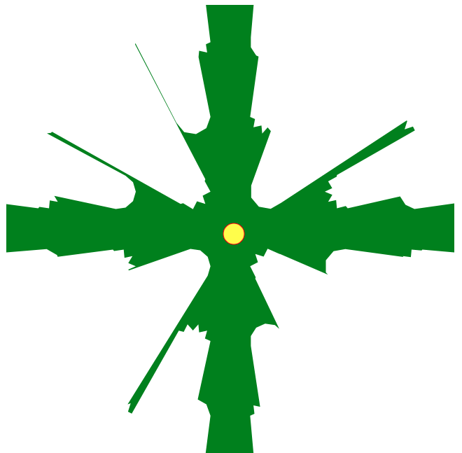
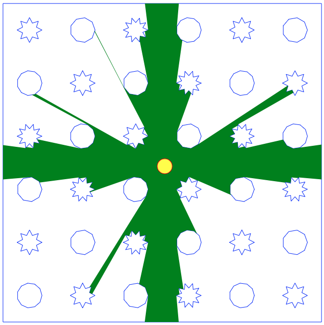

shadows-js
==

See the [demo page]

This library calculates the visible area in a closed room from a central point.
The calculations are exact, to the extent that floating point arithmetic allows.

The inspiration comes from the soldiers' view field in the Commandos game series. 

Limitations
==

* You need to cover the center with walls all-around to get 360 degrees of shadows
* The wall segments cannot overlap, or touch each other in the middle, only end-to-end overlaps are allowed

[demo page]:http://costas-basdekis.github.io/Shadows2.js/
